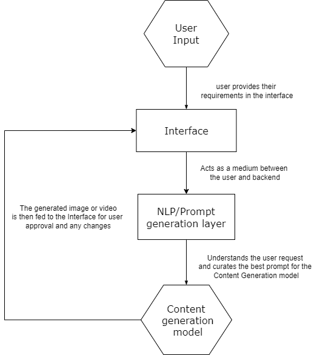

# Realistic AI Model for Digital Influencers

## Introduction

This project involves the development of a cutting-edge AI platform designed to allow users to create personalized digital influencers through a user-friendly text-to-image interface. The platform aims to revolutionize content creation by making it highly accessible and customizable at scale.

## Objective

The main goal was to build an innovative AI-powered platform that empowers users to create and manage digital influencers using intuitive text inputs. This simplifies the process of generating personalized digital content, including images and videos, by automating complex aspects of digital creation, allowing users to focus on creativity and storytelling.

## Approach & Methodology

### Solution Overview

#### Influencer Creation

- Utilized advanced AI algorithms, specifically Generative Adversarial Networks (GANs), to convert textual descriptions into high-quality, photorealistic images.
- Implemented iterative refinement to allow users to continuously adjust the influencer's appearance until it perfectly matches their vision.

#### Content Generation

- Developed dynamic content creation capabilities where users can describe scenes, activities, or backgrounds, and the AI generates relevant images and videos.
- Ensured all complex image processing tasks, like adjusting lighting and modifying environments, are handled seamlessly by the platform’s backend.

### User Interaction and Experience

- Designed a user-friendly interface with real-time previews, allowing users to see immediate results and make quick adjustments.
- Incorporated tooltips and help sections to assist users in crafting effective descriptions and utilizing the platform's features efficiently.

### Technical Infrastructure

- Built on a scalable cloud infrastructure to handle high volumes of users and data processing.
- Ensured data security and compliance with international regulations like GDPR.

## User Interaction Workflow

### User Onboarding

- **Account Creation**: Quick sign-up with email or social media accounts.
- **Introduction Tutorial**: Interactive tutorial to guide new users.

### Influencer Creation

- **Initial Setup**: Users enter descriptive text about the desired characteristics.
- **AI Generation**: AI processes the input to generate a preliminary image using GANs.
- **Refinements**: Users refine the influencer’s appearance through further descriptions or adjustment tools.

### Content Creation

- **Scenario Description**: Users describe scenes or settings for their influencer.
- **Content Generation**: AI generates images or videos based on descriptions.
- **Editing and Enhancements**: Users can tweak generated content using editing tools.

### Content Management

- **Library and Storage**: Automatic saving and organizing of created content.
- **Sharing and Export**: Direct sharing to social media or downloading for other applications.

### Feedback and Iteration

- **User Feedback**: Regular prompts for feedback to guide future updates.

## Technology Stack and System Requirements

### Backend Technologies

- **AI/ML Models**: GPT-4 for NLP tasks and Stable Diffusion models for high-quality image generation.
- **Server Architecture**: Node.js with Express, interfaced with Python for ML tasks.

### Frontend Technologies

- **Web Development**: React.js for a dynamic and responsive UI.
- **Mobile Compatibility**: React Native for cross-platform app development.

### Database and Storage

- **Database**: MongoDB for flexible data handling.
- **File Storage**: AWS S3 for scalable object storage.

### APIs and Integration

- **AI Integration**: OpenAI API for GPT-4 and DALL-E 2 functionalities.
- **ERP Integration**: Custom APIs for integrating with existing content management systems.

### Security and Compliance

- **Data Protection**: HTTPS, OAuth, and AES encryption for secure data handling.
- **Compliance**: Adherence to GDPR and other international data protection regulations.

## Evaluation and Testing

- Conducted extensive unit, integration, and system testing to ensure functionality and reliability.
- Identified key performance indicators (KPIs) to evaluate system performance.
- Integrated user and stakeholder feedback to refine functionalities during the testing phase.

### Brainstorming Sessions

- **Session Objectives**: Focused on feature ideation, problem-solving, and process optimization.
- **Participant Roles**: Included developers, data scientists, and ERP experts.
- **Outcome Documentation**: Documented outcomes were integrated into the project development lifecycle.

## Outcome

The Realistic AI Model project successfully developed a state-of-the-art platform enabling users to create personalized digital influencers through intuitive text-to-image technology. The key outcomes include:

### Advanced Influencer Creation

- Implemented Generative Adversarial Networks (GANs) to transform textual descriptions into high-quality, photorealistic images.
- Enabled users to iteratively refine influencer appearances, ensuring precise alignment with their creative vision.

### Dynamic Content Generation

- Developed AI capabilities to generate contextually relevant images and videos based on user-described scenes and activities.
- Simplified the digital creation process, allowing users to focus on creative direction while the platform handled complex image processing tasks.

### User-Friendly Experience

- Designed a clean and intuitive interface with real-time previews, enhancing user engagement and creativity.
- Provided robust tooltips and help sections to assist users in maximizing the platform's features.

## Sample Image

