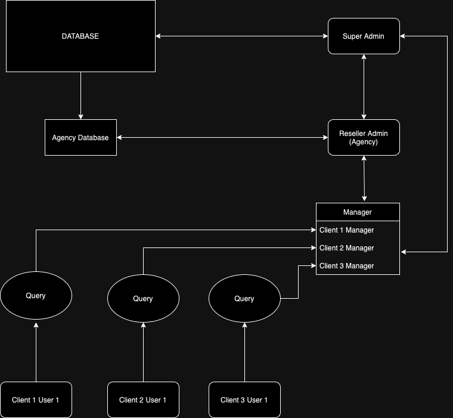
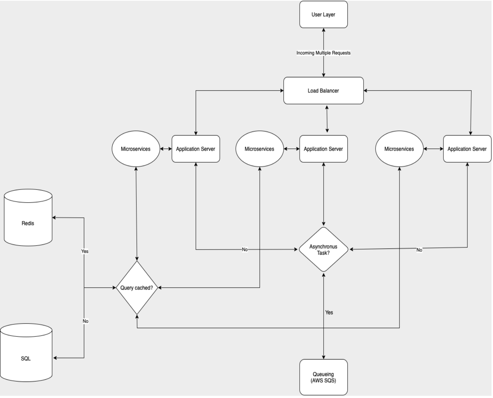
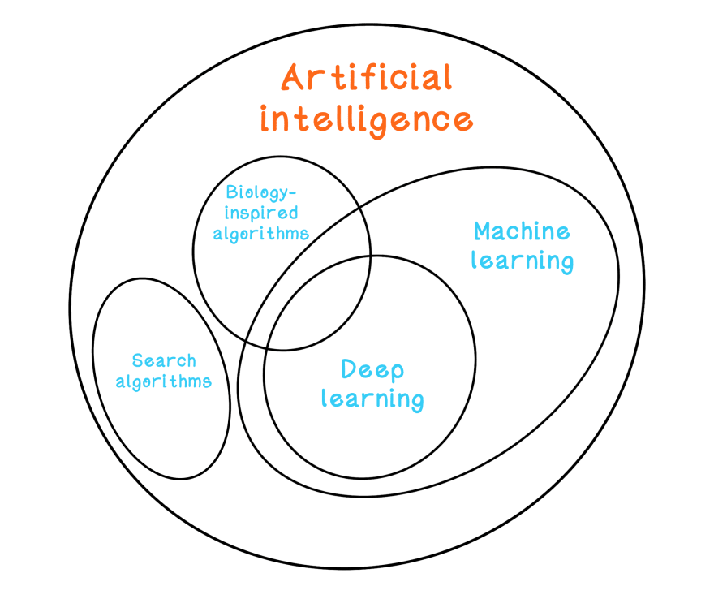

# Innovative Healthcare Marketplace with AI/ML Technology

## Project Overview

### Introduction

This project aimed to create an online marketplace to connect nurses with hospitals and clinics, using advanced AI/ML technologies to streamline the hiring process and enhance operational efficiencies.

## Role and Contributions

### Key Contributions

- Developed AI algorithms for nurse onboarding, pricing adjustments, and matchmaking.
- Designed and implemented an AI chatbot for communications.

## Tools and Technologies Used

- **AI/ML Technologies**: Face recognition, OCR for document verification, AI-driven pricing calculators, and matching algorithms.
- **Development Platforms**: TensorFlow, Hugging Face.
- **Communication Tools**: AI chatbots using custom solutions (e.g., Twilio).
- **Database**: MongoDB, Redis.
- **Frontend**: JavaScript, React, Docker.

## Architecture

## Project Details

### Approach and Methodology

**Mission Understanding**: Emphasis on the need for an on-demand healthcare service and how AI/ML can meet these needs.

**AI/ML Solutions Proposed**:

- Automated nurse onboarding with AI-driven document verification.
- Dynamic pricing calculator to adjust nurse shift prices based on real-time demand.
- AI matching algorithm to efficiently match nurse profiles with hospital requirements.

### Applications

- **User Engagement**: Gamification elements to engage users and interactive features to enhance user experience.
- **Workflow Optimization**: AI automated the onboarding process, credentialing, and verification.
- **Future Scope**: Plans for mobile app development to enhance platform accessibility and user interaction.

### Timelines

- **Development Timeline**:
  - Days 1-2: Project initiation and planning.
  - Days 3-6: Development of core AI functionalities.
  - Days 7-11: Integration of interactive features and user interface enhancements.
  - Days 12-16: Testing, final adjustments, and deployment.

## Conclusion

The "Innovative Healthcare Marketplace with AI/ML Technology" project represents a significant stride forward in the integration of artificial intelligence within the healthcare sector. By successfully deploying a dynamic platform that connects nurses with hospitals and clinics, we have streamlined the hiring process, enhanced job matching accuracy, and improved operational efficiencies. 

The use of cutting-edge AI/ML technologies, including face recognition for onboarding, a dynamic pricing calculator, and an intelligent matching algorithm, has not only optimized resource allocation but also ensured that nurses are fairly compensated based on real-time market demand.

Our project has set a new standard for technological innovation in healthcare marketplaces. The positive feedback from our initial deployments highlights the platform’s potential to significantly impact how healthcare providers manage staffing, which is particularly crucial in a landscape where demand can fluctuate unpredictably. 

Looking forward, the groundwork laid by this project paves the way for further enhancements, including the development of a mobile application that could expand our reach and accessibility.

