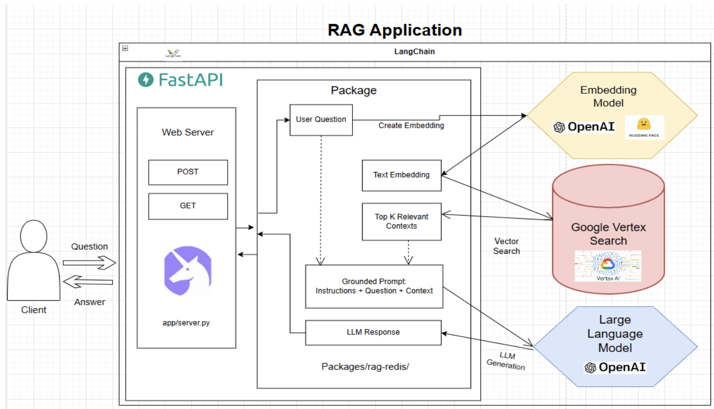

# AI Chatbot for Legal Assistance

## Project Overview

This project entails the development of a sophisticated AI chatbot leveraging the RAG (Retrieve and Generate) architecture, aimed at providing comprehensive legal assistance. The chatbot is designed to retrieve information from a variety of authoritative Spanish legal databases and generate contextually accurate responses to user queries.

## Detailed Description

The AI chatbot uses a two-phase approach:

- **Retrieve Phase**: Searches through extensive legal databases including the Official State Gazette of Spain, Spanish Government Legislation portal, law libraries, and university databases to find relevant content based on user queries. This retrieval process functions like an advanced search engine, understanding the context and specifics of each query.

- **Generate Phase**: Utilizes the retrieved information to construct coherent, contextually appropriate responses. The system employs a lamma index reranking algorithm with an optimal top_k combination to enhance context awareness and accuracy. This allows the chatbot to generate detailed answers, summaries, or new content informed by the retrieved data.

## Technological Stack

### Backend Development

- **Programming Languages**:
  - Python: Ideal for AI and machine learning tasks due to its extensive libraries.
  - Node.js: Efficient for building scalable network applications, suitable for real-time data handling.

- **AI and Machine Learning Frameworks**:
  - TensorFlow: For building and training AI models.
  - Hugging Face Transformers: For handling NLP tasks and utilizing pre-trained models.

- **Databases**:
  - MongoDB: Provides flexible, JSON-like data storage.

- **File Storage**:
  - Amazon S3: For storing and retrieving large amounts of data.

### Frontend Development

- **Web Application Frameworks**:
  - React.js: For building dynamic user interfaces, especially for single-page applications.
  - Alternatives: Angular or Vue.js for those preferring different frameworks.

- **Mobile Application Development**:
  - React Native: For cross-platform mobile app development.

- **Integration with Messaging Platforms**:
  - **APIs**:
    - Twilio API for WhatsApp: For integrating WhatsApp messaging.
    - Telegram Bot API: For integrating with Telegram.

- **User Authentication**:
  - OAuth 2.0 and OpenID Connect: For secure authentication processes.
  - JWT (JSON Web Tokens): For maintaining session states and secure information exchange.

- **Security and Encryption**:
  - SSL/TLS: Ensures secure data transmission.
  - End-to-End Encryption Libraries: Such as OpenPGP.js or libsignal for added security.

### Server and Hosting Solutions

- **AWS Services**:
  - EC2: Provides scalable server capacity.
  - AWS Lambda: For running code in response to events.
  - AWS RDS or DynamoDB: Depending on the chosen database type.

- **Machine Learning Operations (MLOps)**:
  - **Model Training and Deployment**:
    - Docker: For containerization of applications.
    - Kubernetes: Manages orchestration of containerized applications.
    - AWS SageMaker: For model building, training, and deployment.

  - **Monitoring and Logging**:
    - ELK Stack (Elasticsearch, Logstash, Kibana): For real-time logging and monitoring.
    - Prometheus and Grafana: For performance monitoring and alerting.

  - **Error Handling and Recovery**:
    - Sentry: For real-time error tracking and handling.
    - Custom Error Handling Logic: Integrated within the application code.

  - **Continuous Integration/Continuous Deployment (CI/CD)**:
    - Jenkins or GitLab CI/CD: For automated testing and deployment processes.

  - **Learning from Interactions**:
    - Custom Algorithms: Designed to analyze past interactions and improve future responses.
    - Feedback Loops: For continuous learning and platform improvement.

## Outcome

Successfully developed a robust legal assistance platform that enhances accessibility and usability of legal information through advanced AI technologies. The platform integrates seamlessly with multiple legal sources, ensuring users have access to accurate and up-to-date legal information.
