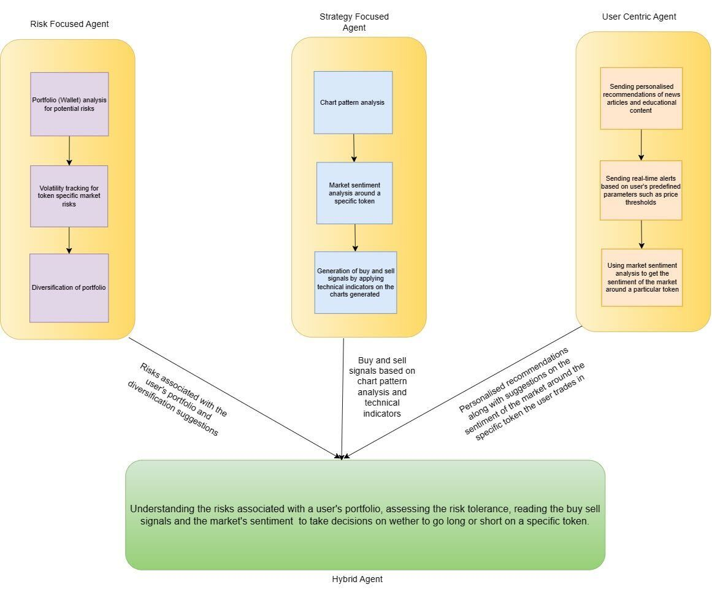

# Project Title: Multi Agent Trading (Crypto)

## Project Overview

In this project, my team and I developed a multi-agent trading system designed to optimize trading strategies through the use of specialized agents. The system integrates sophisticated analysis with real-time market data to enhance trading outcomes for cryptocurrencies. It's structured to be adaptable, allowing for continuous improvement and integration of new technologies and strategies as they evolve.

## Key Features

### Risk-focused Agent

- Implemented portfolio management tools that track wallet balances, transactions, and trading patterns using APIs from Goplus and Gecko Terminal.
- Employed volatility indicators like CVI and Bollinger Bands to monitor market dynamics, aiding in the formulation of risk management strategies.

### Strategy-focused Agent

- Utilized TA-Lib and Quant-Lib for in-depth technical analysis to identify market trends and potential trading opportunities.
- Integrated a Large Language Model for sentiment analysis, enhancing the system’s capability to gauge market sentiment from news sources and adjust strategies accordingly.

### User-centric Agent

- Personalizes content delivery based on the user's trading history, providing real-time alerts and educational material tailored to individual trading preferences and strategies.

### Hybrid Agent

- Combines data and insights from all other agents and incorporates human oversight for decision-making, ensuring robust trading strategies that can adapt to market changes rapidly.

## Workflow

- **Data Integration**: Our system continuously ingests and analyzes data from multiple sources, including direct market feeds, historical data repositories, and user input regarding trading preferences and risk tolerance.
- **Analysis and Execution**: Each agent processes the data independently to generate insights, which are then synthesized by the Hybrid Agent to make informed trading decisions.
- **Continuous Learning**: The system is designed to learn from its operations and outcomes, using this knowledge to refine strategies and improve future performance.

## Tech Stack

- **Programming Languages**: Python and JavaScript were used for backend development and data analysis scripting.
- **Libraries and APIs**: We used TA-Lib, Quant-Lib for technical analysis, and APIs such as Goplus for transaction monitoring and Gecko Terminal for real-time market data.
- **Infrastructure**: The system is hosted on AWS, utilizing EC2 for computing and S3 for data storage, ensuring scalability and reliability.
- **Frontend Development**: Employed React for developing the user interface, providing a responsive and intuitive user experience.

## Architecture Design

## Conclusion

The multi-agent trading system we developed is a testament to our team's expertise in combining financial knowledge with advanced computational techniques. Our system not only adapts to individual user needs but also responds adeptly to market dynamics, providing a robust tool for cryptocurrency trading. This project has been an excellent opportunity to push the boundaries of automated trading technology, and we are committed to its ongoing development and enhancement.

