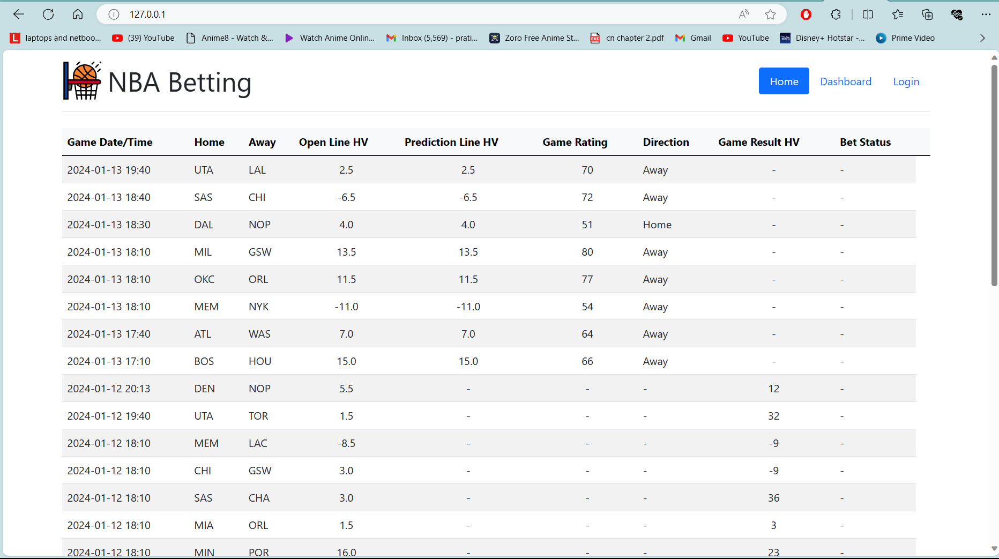
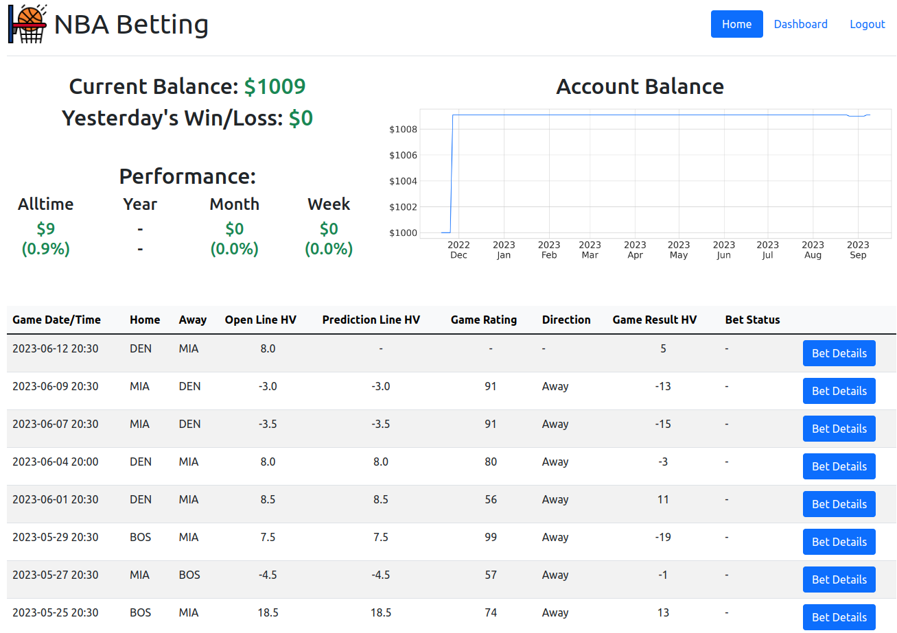

# Project Title: Advanced NBA Betting Application

## Overview

Developed a Flask-based NBA betting application with Scrapy for web crawling and machine learning for predictions. Docker ensures consistent deployment across environments.

- **Timeline**: 3 Weeks

## Key Features

- **Automated Data Pipeline**: Streamlines daily NBA data processing.
- **Comprehensive Betting Options**: Includes various betting lines and updates.
- **Real-Time Updates**: Delivers daily predictions and betting lines.
- **User-Friendly Interface**: Easy navigation for betting and account management.

## Workflow

1. **Data Collection**: Scrape and process daily NBA game data.
2. **Prediction**: Use machine learning to generate game predictions.
3. **Interaction**: Dynamic UI for bet placement and account updates.
4. **Deployment**: Docker containerization for consistent operation.

## Tech Stack

- **APIs**: Flask
- **Web Crawling**: Scrapy
- **Containerization**: Docker
- **Machine Learning**: Auto-DL, Auto-ML
- **Framework**: TensorFlow

## Illustrations

