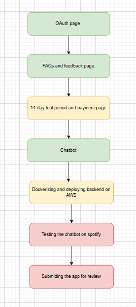
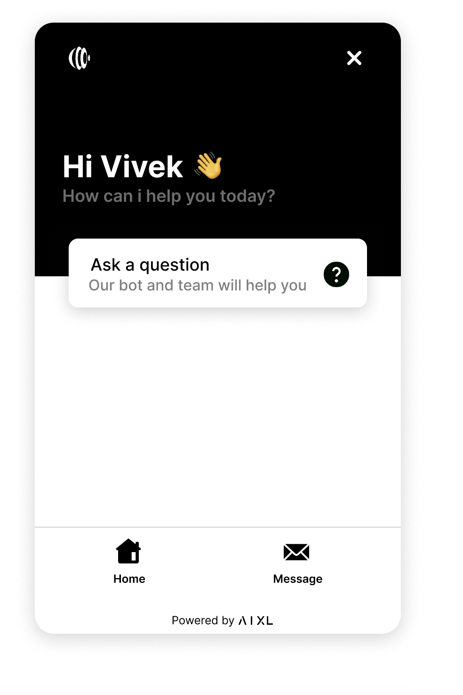
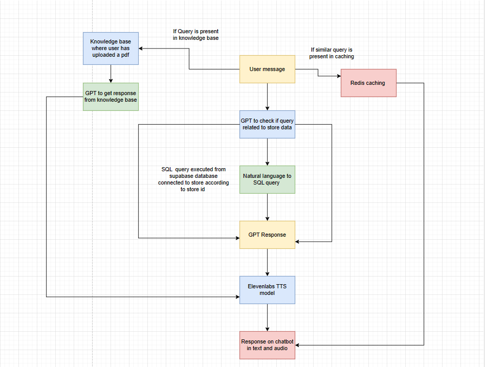
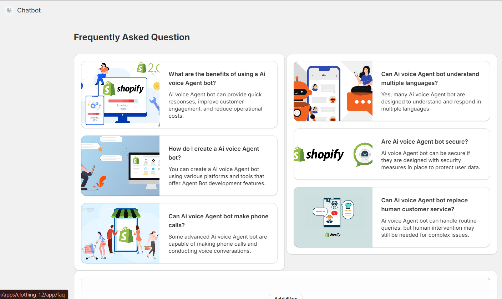

# Voice Assistant ChatBot - Shopify

## Overview

In just four weeks, we developed a comprehensive voice assistant chatbot application for Shopify store owners. The application features a streamlined user experience, beginning with a user-friendly authorization page. Once logged in, users can access a helpful FAQ and feedback section to assist with common inquiries and user support.

The core functionality centers around the voice assistant chatbot that provides real-time interaction with users, aiding them in navigating the store, resolving queries, and improving the shopping experience. The application also includes a trial period feature, allowing users to test the service before subscribing. After the trial, users are directed to a payment page to continue enjoying the chatbot services.

This project aims to enhance user engagement and support for Shopify store owners through a practical and interactive tool.

- **Timeline**: 4 Weeks

## Application Flow

- Oauth page: To get permissions to use store data and connect.
- FAQs and feedback: Additional pages having FAQs about the chatbot and a placard to get feedback from users.
- 14-day trial period and payments page.
- The actual chatbot.
- Dockerizing the locally created chatbot and deploying it on AWS EC2 to get our frontend and backend on Shopify.
- Testing the app on the chatbot once again to check everything is working as expected.
- Submitting the application for review to put our app on the Shopify app store.

## Chatbot Development

1. 500 ms responses even if the data is being fetched from the database.
2. Conversation history to get the chatbot aware of previous questions as well.
3. Connection to Supabase database for storing and retrieving store's information.
4. Addition of knowledge base to the chatbot from a PDF file uploaded by the user according to store id.
5. Addition of another GPT layer to generate a response from the chatbot using the knowledge base.
6. Converting user's natural language questions to SQL queries to be executed on the database.
7. Addition to keep connection alive query to stop the database causing errors and crashing the chatbot that was being faced earlier.
8. Addition of a layer of GPT to identify whether a query is related to the store's information or not.
9. Main layer of GPT that reads the response from the SQL query execution and summarizes it to be displayed to the user. This layer is also responsible for greeting and introducing itself to the user.

## Chatbot Design

## Chatbot Architecture

## FAQ Page

## Tech Stack

- **Languages and Frameworks**: Python, JavaScript, Vite + React, HTML, Tailwind CSS
- **Tools and Platforms**: Shopify CLI, Supabase

