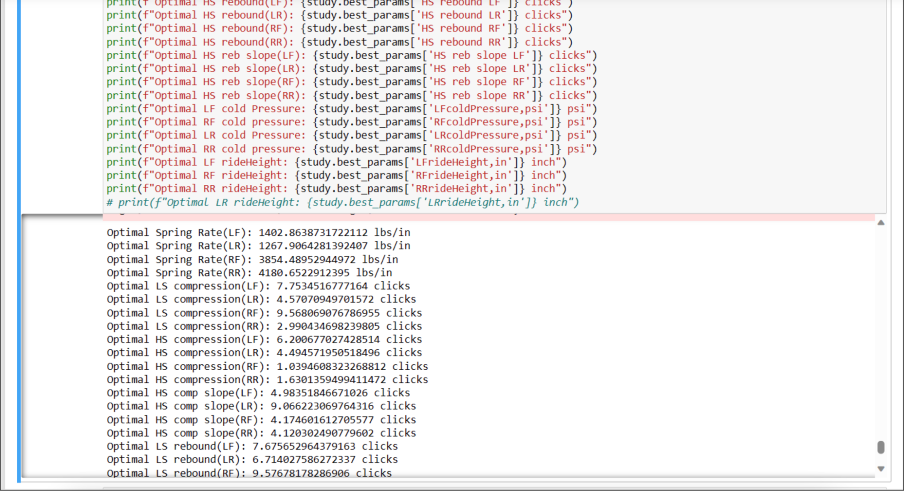
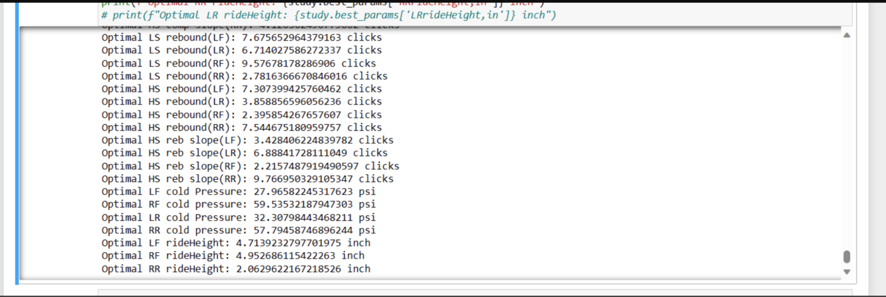
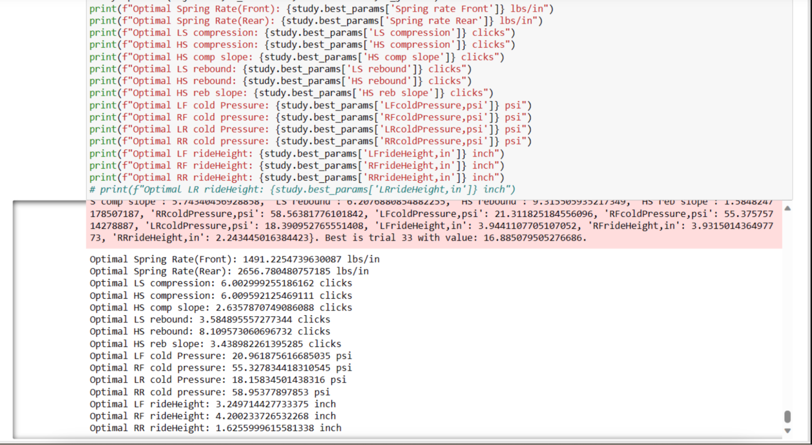

# Telemetry Data Analytics for iRacing Optimization

## Project Overview

**Objective**: This project was developed to create a machine learning model capable of suggesting optimal car setups for iRacing based on track conditions and past performances. The goal was to enhance the racing team's performance by providing data-driven setup recommendations.

**Technologies Used**: Python, pandas for data manipulation, scikit-learn for building the RandomForestRegressor model, and SQL for database integration.

## Role and Responsibilities

- **Data Management**: Managed and cleaned a large dataset exceeding 35GB, involving telemetry data from multiple races.
- **Model Development**: Developed and tested various machine learning models, focusing on the RandomForestRegressor due to its effectiveness in handling non-linear relationships and interactions within the data.
- **Collaboration**: Worked closely with the racing team to define key performance indicators (KPIs) and understand specific needs, ensuring the model provided relevant and actionable insights.

## Challenges and Solutions

- **Large Data Volume**: The primary challenge was processing and analyzing over 35GB of data efficiently. Solutions included optimizing pandas dataframes and using batch processing techniques to manage memory use effectively.
- **Model Integration**: Integrating the model with an existing database required establishing a robust data pipeline and ensuring compatibility with existing data formats and structures.

## Results and Impact

- **Model Performance**: The RandomForestRegressor model was refined through iterative testing, ultimately achieving a high level of accuracy in predicting race outcomes and optimal car settings.
- **Strategic Decisions**: The model's recommendations were adopted by the racing team, leading to improved car performance and strategic decision-making in race preparations.

## Documentation and Support

- **Documentation**: Produced comprehensive documentation detailing the system architecture, model usage, and setup recommendations, facilitating easy adoption and ongoing maintenance.
- **Support**: Developed a support guide to assist the racing team in implementing the model's recommendations and making adjustments based on evolving track conditions.

## Visuals and Code Samples

## Reflections and Learnings

This project not only enhanced our skills in handling large datasets and building effective machine learning models but also deepened my understanding of the dynamic and complex domain of racing telemetry.

